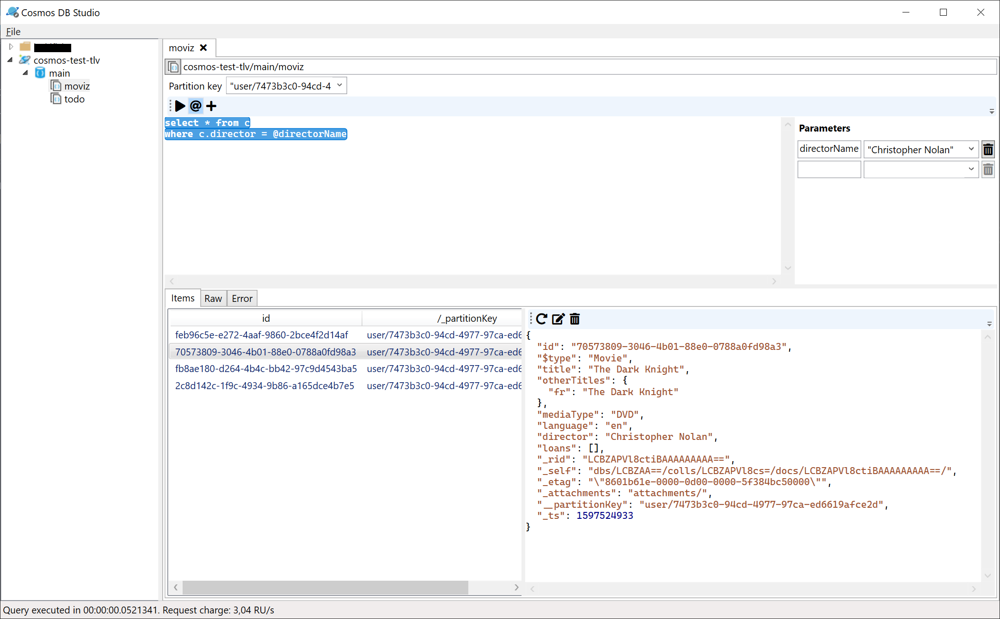

# Cosmos DB Studio

A tool to browse and query Azure Cosmos DB databases.

I created this app out of frustration with the completely broken experience in Azure Storage Explorer (which is basically the
same as Data Explorer in the Azure portal, with the same limitations and many more bugs).

It's a bit rough around the edges, and some features are still missing, but it's mostly functional.

## Requirements

You will need Windows 10 version 1803 or later.
It might work on older Windows versions if you build from source (you will need the .NET Core 3.1 SDK),
but the packaged application requires Windows 10, and I didn't take any step to ensure it would work on
other versions.

## Installation

### From the Windows Store

The app is available [on the Windows Store](https://www.microsoft.com/en-us/p/cosmos-db-studio/9mxmw2k8j04h).

### Sideloading

1. Download the package from the [release page](https://github.com/thomaslevesque/CosmosDBStudio/releases/latest).
2. If it's the first time you install the application, you will need to trust the app certificate:
    1. Open the *Properties* dialog for the package file.
    2. Go to the *Digital signatures* tab.
    3. Select the signature from the list and click *Details*.
    4. Click *View certificate*.
    5. Click *Install certificate*.
    6. Select *Local machine* as the store location, and accept the UAC dialog.
    7. Choose *Place all certificates in the following store*, click *Browse*, and select *Trusted People*.
    8. Click *Next*, then *Finish*
3. Enable developer mode to allow sideloading, if not already done:
    1. Open Windows settings
    2. Go to *Update and security*
    3. Go to the *For developers* section
    4. Enable *Developer mode*
4. Double click the package and follow the instructions.

## Getting started

1. Start the app
2. Right click in the left pane to add a Cosmos DB account. Enter a name, the account endpoint and key, and an optional folder
   to organize your account. (If you have a Cosmos DB connection string in the clipboard, the endpoint and key will be
   filled automatically)
3. Expand the account node in the treeview to select a database (or create a new one from the context menu)
4. Expand the database node in the treeview to select a container (or create a new one from the context menu)
5. Right-click the container node and select "New query sheet". This will create a new SQL query sheet for this container.
6. Enter a valid Cosmos DB SQL query and hit Ctrl-Enter. It will select the whole query and execute it.
7. The results will appear in the bottom pane

**Tip**: you can have multiple queries in the same query sheet, just separate them with an empty line.
